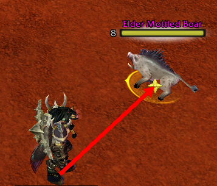

# Combat Range Finder 1.1.0
Indicators for easing melee combat
---
Requires [SuperWoW.dll](https://github.com/balakethelock/SuperWoW) and `VanillaUtils.dll`  
`VanillaUtils.dll` is [provided in the release zip](https://github.com/MarcelineVQ/CombatRangeFinder/releases), load it in the same manner you use to load SuperWoW.  
e.g. By adding it to your dlls.txt file if you use VanillaFixes.  

---
Features:
* Indication of whether you're in real melee range.
* Indication of whether you're facing the mob you're targeting.
* Mob facing indicator to position behind a mob in a melee dogpile.
* Raid markers show at enemy feet so they can be seen on large mobs.

___
Options `/crf` :
* `enable` : Enable or disable addon
* `arrow` : Show indicator arrow for (attackable) target
* `largearrow` : Use a larger arrow for enemies who are in range
* `any` : When arrow is enabled, show for non-attackable targets too
* `markers` : Show raid markers at enemy feet

___
* Made by and for Weird Vibes of Turtle Wow  
